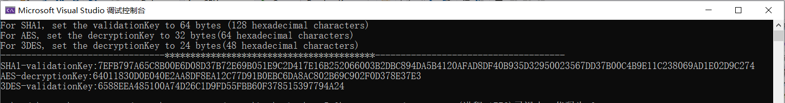

# GenerateRandomKey
Configure MachineKey in ASP.NET2.0

Reference：https://docs.microsoft.com/en-us/previous-versions/msp-n-p/ff649308(v=pandp.10)

Configure  MachineKey ：
` <system.web>
    <machineKey   validationKey="A95827C12F9CCE906AEB8E318AE426B0A3BDE44427348AA219C0AC4408926F9AF3735291C18D2116B8C0AFEB0EDBEF2B48722FEC9CA8D5FAABE2A7E82D6F142D"
    decryptionKey="61D326AB008C314249AAD033517609793CBD6A93394C3AF93D6B003544F36363"
    validation="SHA1"
    decryption="AES"/>` 

`.....
  </system.web>`

